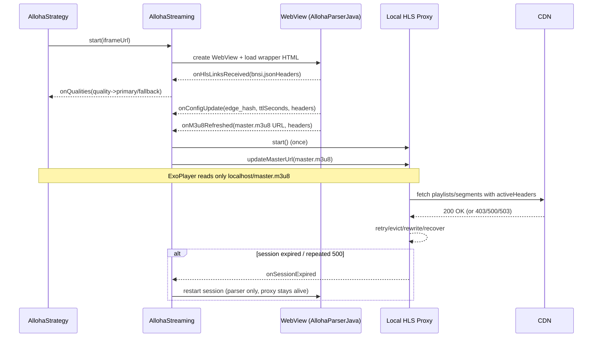

# Alloha balancer (XFloraFilm)

Этот пакет реализует воспроизведение Alloha в стиле “как в Kotlin-референсе”:

- **WebView** (скрытый) поднимает iframe-плеер Alloha и перехватывает сетевую активность JS.
- Из WebView извлекаются **runtime headers** (`authorizations`, `accepts-controls`, `origin`, `referer`, `user-agent`, cookie, и т.д.).
- Из `bnsi` извлекаются ссылки качества вида `primaryUrl or fallbackUrl`.
- Локальный прокси `HlsProxyServerJava` (localhost:8080) выступает как **единственная точка**, откуда ExoPlayer читает HLS.
- При протухании токенов, CDN failover и ошибках `500/503` поток восстанавливается: обновляется `master.m3u8`, переписываются сегменты на актуальный путь, делаются ретраи/evict соединений.

## TL;DR (самая важная идея)

**ExoPlayer всегда играет `http://127.0.0.1:8080/master.m3u8`.**

А всё “магическое” (обновление CDN URL, токенов, заголовков, recovery) происходит внутри:

- `AllohaStreaming` (управляет сессией WebView и обновляет прокси)
- `HlsProxyServerJava` (проксирует HLS и лечит ошибки)

---

## Визуализация (flow)

```mermaid
flowchart LR
  UI[Player/Strategy/AllohaStrategy] -->|iframeUrl| S[AllohaStreaming]
  S -->|main thread| WV[AllohaParserJava\nWebView + JS bridge]
  WV -->|bnsi json| B[AllohaBnsiParserJava\nprimary/fallback]
  WV -->|headers snapshots\nconfig_update/stream_push| H[(activeHeaders\nConcurrentHashMap)]
  S -->|start once| P[HlsProxyServerJava\nlocalhost:8080]
  H --> P
  WV -->|m3u8_refresh URL| S
  S -->|proxy.updateMasterUrl(m3u8)| P
  EXO[ExoPlayer] -->|always reads| P
  P -->|real CDN requests| CDN[(Alloha CDN)]
```

---

## Визуализация (жизненный цикл сессии)



---

## Ключевые классы

### `AllohaStreaming`

Задача: управлять **WebView-сессией** и обновлять прокси, НЕ ломая ExoPlayer.

Особенности:

- **WebView создается строго на main thread**.
- При рестарте сессии:
  - **не останавливает прокси** (иначе ExoPlayer ловит EOF),
  - перезапускает только WebView-парсер,
  - рестарты **debounced** (защита от циклов при плохом CDN).
- На `onM3u8Refreshed` делает `proxy.updateMasterUrl(url)` — это “переключает” поток.
- `tryFallbackOnce()` (по `onPlayerError`) переключает на **fallback URL** из `bnsi` (вторая ссылка после `"or"`).

### `AllohaParserJava`

Задача: изнутри iframe собрать:

- `bnsi` (JSON, где `hlsSource[].quality` содержит `primary or fallback`),
- **заголовки**, которые реально использует браузерный плеер,
- `m3u8_refresh` (актуальный `master.m3u8`),
- `config_update` по WebSocket: `edge_hash`, `ttlSeconds`,
- heartbeat `playing` каждые ~25s, чтобы сессия не считалась “мертвой”.

### `HlsProxyServerJava`

Задача: дать ExoPlayer стабильный локальный источник:

- `/master.m3u8` — отдает текущий `activeMasterUrl` (через `updateMasterUrl`).
- `/proxy?url=...` — проксирует плейлисты/сегменты.

Встроенные “лечилки”:

- переписывание сегментов на текущий путь после refresh (когда старые подписи протухли),
- `evictAll()` + `Connection: close` для `stream-balancer`,
- retry на `403`, `500`, `503`,
- recovery сегмента по свежему playlist,
- prefetch следующих сегментов,
- при “плохом” `stream-balancer` может дернуть `onSessionExpired` → `AllohaStreaming` перезапустит WebView-сессию.

### `AllohaBnsiParserJava`

Разбирает `bnsi` и возвращает:

- `quality -> (primaryUrl, fallbackUrl)`

Формат источника: строка вида:

```
https://primary/master.m3u8 or https://fallback/master.m3u8
```

---

## Почему иногда “падает и потом снова играет”

Если CDN отдает `500/503`, а ExoPlayer получил ошибку сегмента, то:

- WebView может успеть обновить токены/URL,
- прокси переключится на новый `master.m3u8`,
- повторный `Play` “попадает” уже на рабочий узел.

Стабилизация достигается за счет:

- ретраев + `Connection: close` + evict,
- рестарта WebView-сессии **без остановки прокси**,
- fallback URL из `bnsi`.

---

## Где смотреть отладку

- Логи `AllohaParserJS` — heartbeat, WS hook, config_update.
- Логи `HlsProxyJava` — HTTP коды от CDN, ретраи, rewrite сегментов, recovery.
- Файл trace (если используешь): `alloha_http_trace.jsonl`.
